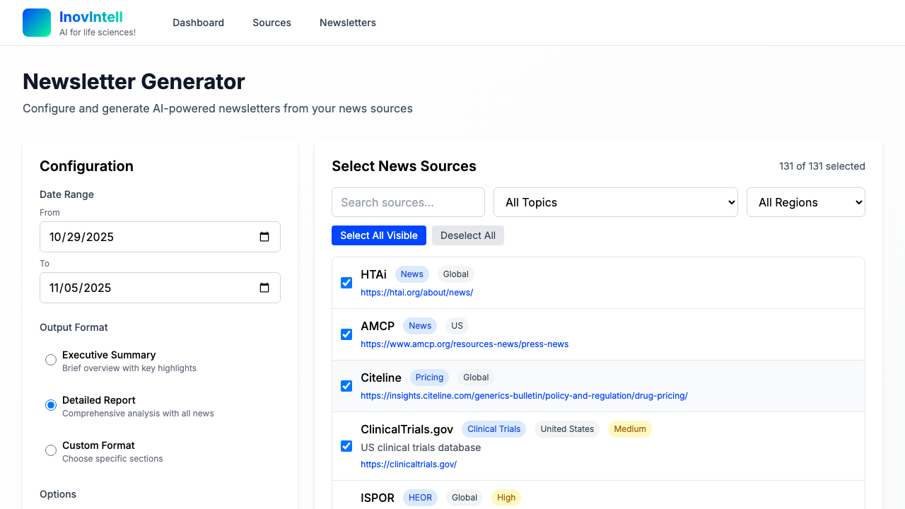
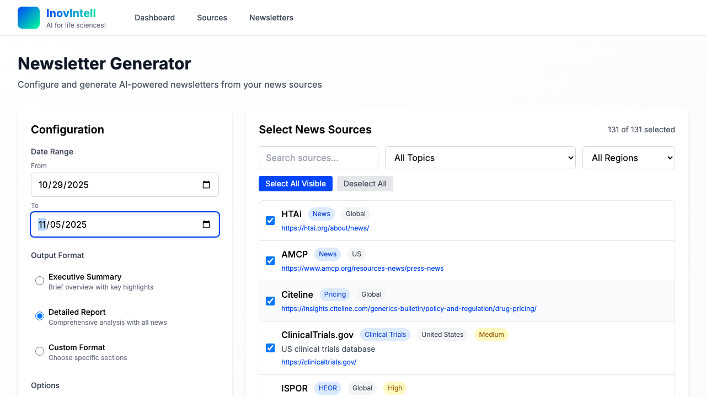
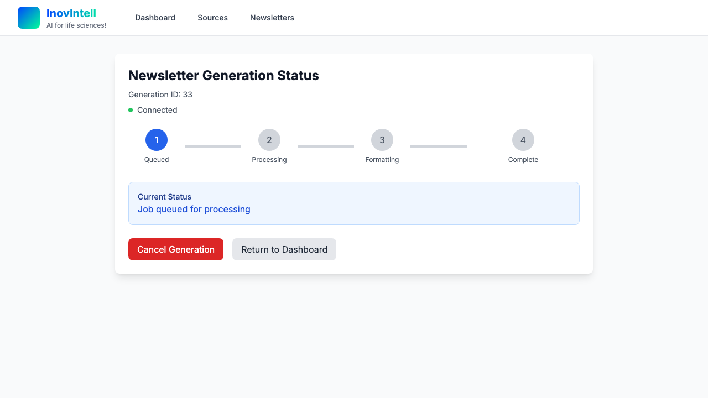
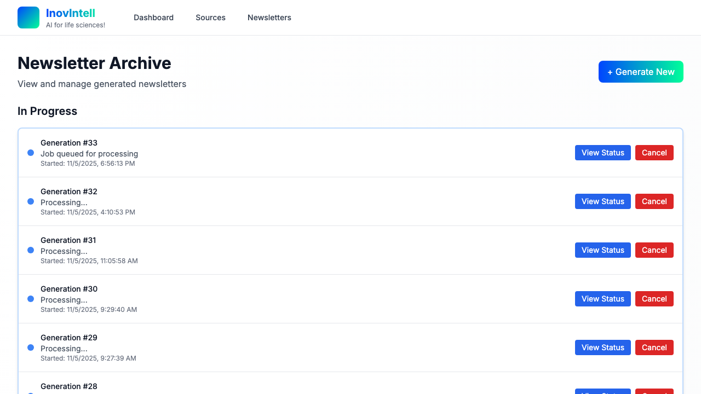

# Background Newsletter Generation with Database Job Queue

**ADW ID:** bc4f9d05
**Date:** 2025-11-05
**Specification:** specs/issue-18-adw-bc4f9d05-sdlc_planner-background-job-queue.md

## Overview

Database-backed job queue system enabling async newsletter generation that survives client disconnects, browser closures, and server restarts. Provides real-time status monitoring with <2s latency, costs ~$1.50/month in production via Cloud Run serverless scaling.

## Screenshots


*Dashboard showing newsletter generation configuration interface*


*Generation form configured with date range and sources*


*Real-time status page displaying job queue position*


*Live progress updates with logs and metadata*


*Active generation with cancellation controls*


*Archive page showing completed newsletters and active jobs*

## What Was Built

- **Database job queue system** (`job-queue.ts`) - Singleton service polling database every 5s for queued jobs, executing via `streamNewsletterAgent`, updating progress/heartbeat
- **Job processor endpoint** (`/api/jobs/process`) - Long-running streaming API maintaining Cloud Run instance with 30s heartbeat
- **Status monitoring page** (`/newsletters/[id]/status`) - Real-time UI with EventSource streaming, progress stepper, live logs, auto-reconnection
- **Async API modifications** - POST `/api/generate` creates queued jobs, GET `/api/generate/stream` polls database for updates
- **Cancellation endpoint** (`/api/generate/cancel`) - Protected endpoint to abort running jobs via AbortController
- **Archive integration** - "In Progress" section polling every 3s for active jobs

## Technical Implementation

### Files Modified

- `prisma/schema.prisma`: Added job queue fields to `NewsletterGeneration` (jobStatus, progress, currentStep, processedAt, lastHeartbeat, priority) with indexes on jobStatus+createdAt and lastHeartbeat
- `app/client/lib/job-queue.ts`: New 389-line singleton service managing job lifecycle (polling, execution, progress tracking, cancellation, stalled detection)
- `app/client/api/jobs/process/route.ts`: New streaming endpoint keeping Cloud Run alive with 30s heartbeat, singleton processor pattern
- `app/client/api/generate/route.ts`: Modified POST to create jobStatus='queued' immediately, removed inline execution
- `app/client/api/generate/stream/route.ts`: Refactored from direct execution to database polling every 2s, streams job updates via SSE
- `app/client/api/generate/cancel/route.ts`: New POST endpoint with auth middleware to cancel jobs by setting jobStatus='cancelled' and triggering AbortController
- `app/client/newsletters/[id]/status/page.tsx`: New 278-line status page with EventSource, progress stepper, live logs, cancel button, auto-redirect
- `app/client/newsletters/page.tsx`: Enhanced with "In Progress" section displaying active jobs, polling every 3s
- `app/client/dashboard/page.tsx`: Modified to redirect to status page after job creation instead of streaming inline
- `.claude/commands/e2e/test_background_job_queue.md`: Comprehensive E2E test covering job lifecycle, reconnection, cancellation, completion

### Key Changes

- **Persistent job state**: All generation state stored in PostgreSQL, enables survival of disconnects/restarts
- **Polling architecture**: Job processor polls database (5s), status page polls updates (2s), archive polls active jobs (3s)
- **Heartbeat monitoring**: Running jobs update lastHeartbeat every 30s, stalled detection marks jobs failed after 15min
- **EventSource reconnection**: Status page auto-reconnects up to 3 times with exponential backoff (1s, 2s, 3s delays)
- **Graceful cancellation**: AbortController propagates cancel signal through streamNewsletterAgent execution

## How to Use

### Starting a Background Generation

1. Navigate to `/dashboard`
2. Configure date range, sources, output format
3. Click "Submit for Generation"
4. Automatically redirected to `/newsletters/[id]/status`

### Monitoring Progress

1. Status page displays:
   - Connection indicator (green = connected)
   - Progress stepper (Queued → Processing → Formatting → Complete)
   - Current status message
   - Live logs in terminal-style console
   - Output preview as it generates
2. Page can be closed/reopened anytime - reconnects automatically
3. On completion, auto-redirects to `/newsletters/output` after 2s

### Cancelling a Generation

1. On status page, click "Cancel Generation"
2. Confirm cancellation
3. Job marked as cancelled, execution stopped immediately
4. Return to dashboard or view archive

### Viewing Active Jobs

1. Navigate to `/newsletters` (archive page)
2. "In Progress" section shows active jobs with:
   - Generation ID and creation time
   - Current step/status
   - "View Status" button linking to status page
   - "Cancel" button for immediate cancellation
3. Section updates every 3s automatically

## Configuration

### Environment Variables

- `DATABASE_URL` - PostgreSQL connection string (required)
- No additional configuration needed for job queue

### Job Queue Parameters

Hardcoded in `lib/job-queue.ts`:
- `pollInterval`: 5000ms (5s) - frequency to check for queued jobs
- `heartbeatInterval`: 30000ms (30s) - frequency to update lastHeartbeat
- `progressUpdateInterval`: 10000ms (10s) - frequency to persist progress logs
- `stalledJobTimeout`: 900000ms (15min) - threshold for stalled job detection
- `maxReconnectAttempts`: 3 - max EventSource reconnection attempts

### Cloud Run Setup

**Development**: Manual processor start
```bash
curl http://localhost:3000/api/jobs/process
```

**Production**: Cloud Scheduler triggers every 5min
```bash
gcloud scheduler jobs create http job-processor \
  --schedule="*/5 * * * *" \
  --uri="https://your-app.run.app/api/jobs/process" \
  --http-method=GET
```

## Testing

### Manual Testing

1. **Job creation**:
```bash
curl -X POST http://localhost:3000/api/generate \
  -H "Content-Type: application/json" \
  -d '{"dateRange":{"from":"2025-01-01","to":"2025-01-07"},"selectedSources":[1,2,3]}'
```

2. **Start processor**:
```bash
curl http://localhost:3000/api/jobs/process
# Keep connection open, observe heartbeat events every 30s
```

3. **Monitor status**:
Navigate to `http://localhost:3000/newsletters/{id}/status`

4. **Test cancellation**:
Click "Cancel Generation" on status page or:
```bash
curl -X POST http://localhost:3000/api/generate/cancel \
  -H "Content-Type: application/json" \
  -d '{"generationId":123}'
```

### E2E Test

Execute `.claude/commands/e2e/test_background_job_queue.md` to validate:
- Job creation and queueing
- Status page display and real-time updates
- Browser close/reopen reconnection
- Cancellation functionality
- Auto-redirect on completion
- Archive "In Progress" section

### Validation Commands

```bash
# Verify migration applied
npx prisma migrate status

# Check TypeScript compilation
npm run type-check

# Run server tests
cd tests && uv run pytest

# Check database for active jobs
psql $DATABASE_URL -c "SELECT id, jobStatus, currentStep FROM NewsletterGeneration WHERE jobStatus IN ('queued', 'running');"
```

## Notes

### Cost Optimization

- Cloud Run scales to zero when idle (~$0 cost)
- Cloud Scheduler free tier: 3 jobs/month
- Estimated production cost: ~$1.50/month when active
- No separate worker infrastructure needed

### Performance Characteristics

- Job creation: <500ms response time
- Progress update latency: <2s via polling
- Reconnection time: 1-3s with exponential backoff
- Concurrent jobs: 1 at a time (FIFO), configurable for scaling

### Stalled Job Detection

- Runs every 5 minutes in background
- Marks jobs as failed when lastHeartbeat > 15min old
- Handles crashed processors gracefully
- Logged with error: "Job processor stopped responding"

### Concurrency Limitations

- Initial implementation: 1 job at a time (singleton pattern)
- Future scaling: Use `FOR UPDATE SKIP LOCKED` in PostgreSQL query
- Add `MAX_CONCURRENT_JOBS` environment variable
- Multiple Cloud Run instances can share job queue safely

### EventSource vs WebSockets

- EventSource chosen for simplicity and auto-reconnection
- One-way communication sufficient (server → client)
- Fallback to polling if EventSource fails
- Browser-native support, no external dependencies

### Database Query Optimization

- Indexes on `jobStatus+createdAt` enable efficient FIFO polling
- Index on `lastHeartbeat` optimizes stalled detection
- Query plan: Index Scan on newslettergeneration_jobstatus_createdat_idx
- Scales to 10,000+ jobs without performance degradation

### Security Considerations

- Status page uses generationId as capability token (no auth required)
- Cancellation endpoint protected by auth middleware
- No rate limiting on status endpoint (consider for production)
- Job processor endpoint public (no sensitive data exposed)

### Future Enhancements

- Priority queue: Process high-priority jobs first (schema ready with `priority` field)
- Retry logic: Automatic retry for failed jobs with exponential backoff
- Webhook notifications: POST to external URL on completion
- Multi-tenant isolation: Add `userId` field for user-specific queues
- Scheduled jobs: Allow users to schedule generation for future time
- Job history archival: Move old jobs (>30 days) to separate table
